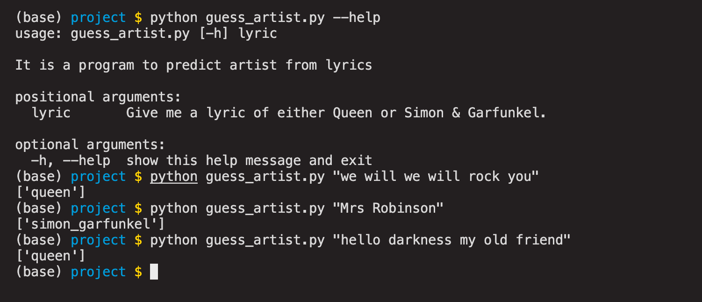

# LyricClassifier
Goal : predict artist(one of two) according to command-line user input of lyric string

Contents : 
- guess_artist.py : user command interface run python guess_artist.py <lyric sting of one artist> will return the model prediction of the artist of the given lyric
- artist_lyric_scraper.py : scraping artist and corresponding lyrics from webpage and save to folder with name of artist with lyric of each song saved in one txt file
- train_save_model.py : train and save logistic regression model that predicts artist based on lyrics
- artist_predictor.pkl : trained model generated by train_save_model.py and is used in guess_artist.py
- TextCleaner.py : Custom basic TextCleaner class to clean the lyrics. It is used in train_save_model.py
- folder queen and simon_garfunkel are generated by artist_lyric_scraper.py for saving the lyric

Results : 

